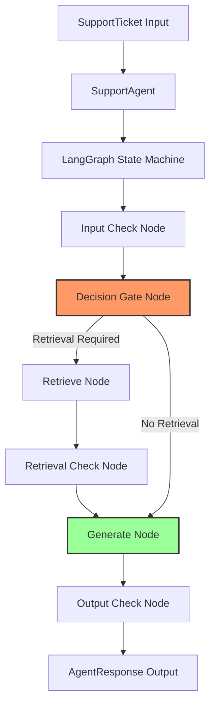

# SupportSphere AI — Architecture Specification

This document details the refactored, production-grade architecture of the SupportSphere AI agent workflow, designed in adherence to **SOLID**, **KISS**, **DRY**, and **Clean Architecture** principles.

---

## 1. Architectural Overview

SupportSphere AI leverages a stage-based state machine powered by **LangGraph** to process incoming customer support tickets, classify them, retrieve context from local documentation databases, run safety guardrails, and generate replies.

### High-Level Architecture Diagram

---

## 2. Key Refactored Components

### 2.1 Stage-Based LLM Registry (`LLMRegistry`)
Instead of hardcoding providers/models inside nodes or restricting the architecture to a fixed set of two models, the system introduces a **Stage-Aware Registry** (`src/ai/registry.py`).
- **SRP (Single Responsibility)**: Resolving configuration details is the registry's sole job.
- **Reserved Stages**: Supports future stages like `evaluation`, `reranker`, `summarizer`, `planner`, and `classifier`.
- **Dynamic Override Detection**: Automatically intercepts manual legacy overrides to `LLM_PROVIDER` or `LLM_MODEL` (for example, in local batch evaluation scripts), preserving 100% backward compatibility.

### 2.2 Provider-Agnostic Caching Client (`LLMClient`)
The `LLMClient` class orchestrates connections to multiple upstream providers (Google, OpenAI, Groq, Anthropic, Ollama).
- **Caching**: Reuses LangChain client instances dynamically per provider/model combo, preventing initialization latency.
- **Single-Call token capture**: Employs LangChain `.with_structured_output(Schema, include_raw=True)` to retrieve the parsed schema and raw `AIMessage` container carrying `usage_metadata` (input/output tokens) in a **single LLM request**. This eliminates the previous duplicate LLM calls.

### 2.3 Immutable LLM Result Models
To ensure clean interfaces, the client returns structured, immutable containers:
- `LLMUsage` (input_tokens, output_tokens, total_tokens)
- `LLMResult` (response, usage, latency, provider, model, raw_response)

### 2.4 Decoupled Billing Engine (`BillingCalculator`)
The billing engine (`src/billing/calculator.py`) is completely independent of LLM libraries (LangChain/OpenAI).
- It consumes generic `TokenUsage` structures only.
- Supports independent stage-based pricing, looking up costs for the Decision Gate and Generation steps in the catalog independently.

---

## 3. Separation of Concerns (SRP)

| Component | Responsibility | Does NOT know about... |
| :--- | :--- | :--- |
| **Nodes** (`nodes.py`) | Execute business logic and orchestrate state transitions. | LLM Providers, API keys, parsing strings, or token retrieval. |
| **LLM Client** (`client.py`) | Execute chat queries and measure raw performance details. | State variables, ticket fields, or guardrail details. |
| **Registry** (`registry.py`) | Resolve stage-specific models, providers, and key mapping. | Node execution, billing catalogs, or prompt construction. |
| **State** (`state.py`) | Maintain shared business data. | LLM clients, LangChain objects, or temporary parser flags. |
| **Billing** (`calculator.py`) | Compute prices for tokens and retrieval queries. | Provider credentials, LangChain formats, or Graph nodes. |
